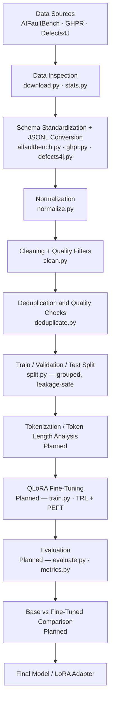

# ForgeMind

Fine-tuning **Meta Llama 3.2 3B Instruct with QLoRA** for **programming and
software-engineering instruction tuning**: debugging, root-cause analysis, bug
analysis, fix walkthroughs, error analysis, and issue-to-resolution reasoning —
not a generic coding assistant.

The project adapts a small open-weights model to reason about real software
faults using parameter-efficient fine-tuning (QLoRA) on top of a curated,
provenance-tracked instruction dataset built from three established
software-engineering benchmarks.

> **Status: dataset preparation stage.** The data pipeline (acquisition →
> conversion → normalization → cleaning → deduplication → splitting) is
> implemented and covered by a test suite. **QLoRA fine-tuning, evaluation,
> and base-vs-fine-tuned comparison are planned / in progress** — the
> training and evaluation code is scaffolded but not yet implemented, and no
> training runs have been completed. See [Project Status](#project-status).

---

## Project Status

| Stage | Status |
|---|---|
| Dataset acquisition (raw downloads) | Implemented |
| Dataset inspection & analysis | Implemented (CLI statistics); analysis notebooks scaffolded |
| Cleaning, schema standardization, JSONL conversion | Implemented |
| Deduplication & quality checks | Implemented |
| Train / validation / test split | Implemented |
| Tokenization / token-length analysis | Planned |
| QLoRA fine-tuning | Planned (scaffolded, not implemented) |
| Evaluation | Planned (scaffolded, not implemented) |
| Base vs fine-tuned comparison | Planned |

No results, metrics, or fine-tuned model artifacts exist yet; nothing in this
repository reports training or evaluation outcomes.

## Overview

Modern LLMs are strong at general programming questions but comparatively
weak at the *engineering* side of software: reading a failing stack trace,
localizing a fault, reasoning about what a diff changes, and explaining what
is and is not known about a bug from the available evidence.

ForgeMind explores whether **parameter-efficient fine-tuning of a small
model (Llama 3.2 3B) on high-quality, evidence-grounded software-engineering
examples** can improve that behavior at a computational cost an individual
can afford.

Why this approach:

- **Fine-tuning vs. prompting.** Prompting a general model produces general
  behavior. Instruction tuning on a narrow, high-quality distribution is a
  controlled way to test whether the model's output *format and structure*
  (e.g., structured fault analysis) can be made more consistent, and whether
  domain-grounded examples help on this task family.
- **Programming/DSA data.** The sources are real-world fault reports,
  issue–pull-request pairs, and reproducible Java bugs from established
  benchmarks — not synthetic question/answer pairs. Training on real
  engineering artifacts targets the kind of reasoning the project wants the
  model to practice.
- **Data quality first.** Instruction-tuning quality is dominated by dataset
  quality. Heterogeneous sources (CSV, JSON, raw logs) are normalized into
  one schema, filtered for quality, deduplicated exactly and approximately,
  and split with leakage prevention *before* any model sees them. This
  pipeline is the part of the project that is complete and tested.

## Goals

1. Build a clean, deduplicated, provenance-tracked instruction-tuning dataset
   from three software-engineering datasets.
2. Fine-tune Llama 3.2 3B using QLoRA (4-bit quantized base + LoRA adapters).
3. Keep the compute footprint small through parameter-efficient fine-tuning.
4. Evaluate the fine-tuned model on programming/software-engineering tasks.
5. Compare base vs fine-tuned model behavior on identical prompts.
6. Demonstrate the complete LLM fine-tuning workflow end to end, from raw
   third-party data to a reproducible training artifact.

## Pipeline



Stages without the *Planned* marker are implemented and tested
(`tests/data/test_pipeline.py`).

## Repository Structure

```text
forgemind/
├── configs/
│   ├── data_config.yaml        # data pipeline knobs (seed, ratios, thresholds, enable flags)
│   └── qlora.yaml              # training configuration — placeholder, to be finalized
├── data/
│   ├── raw/                    # original downloads (immutable; gitignored)
│   ├── processed/              # per-source converted JSONL (common schema; gitignored)
│   ├── final/                  # cleaned, deduplicated train/validation/test JSONL (gitignored)
│   └── evaluation/             # evaluation prompts (test_questions.json — scaffold, empty)
├── notebooks/
│   ├── 01_dataset_analysis.ipynb      # dataset exploration — scaffold (imports only)
│   ├── 02_qlora_experiments.ipynb     # QLoRA experiments — scaffold (empty)
│   └── 03_model_evaluation.ipynb      # evaluation workflows — scaffold (empty)
├── outputs/
│   ├── checkpoints/            # adapter/checkpoint output (gitignored, empty)
│   ├── evaluation/             # evaluation reports (gitignored, empty)
│   └── logs/                   # training logs (gitignored, empty)
├── scripts/
│   ├── prepare_data.py         # thin wrapper — placeholder
│   ├── train.py                # QLoRA training entry point — placeholder
│   └── evaluate.py             # evaluation entry point — placeholder
├── src/
│   ├── data/                   # complete data pipeline (see Data Processing Workflow)
│   ├── training/               # train.py, config.py — scaffolded, not implemented
│   ├── evaluation/             # evaluate.py, metrics.py — scaffolded, not implemented
│   ├── inference/              # generate.py — scaffolded, not implemented
│   └── app.py                  # demo application — scaffolded, not implemented
├── tests/
│   └── data/test_pipeline.py   # schema, cleaning, dedup, split, leakage tests
├── assets/
│   ├── architecture.png
│   └── demo.png
├── DATASETS.md                 # dataset sources, licenses, attribution
├── LICENSE                     # MIT (project code)
├── requirements.txt            # data-pipeline dependencies (minimal by design)
└── .env.example                # environment variable template
```

## Dataset Preparation

The pipeline converts three heterogeneous sources into one consistent
instruction-response schema, then filters and splits. Raw data is immutable:
converters read `data/raw/` and never write to it.

### From heterogeneous formats to one schema

The sources arrive as CSV (`ghpr.csv`, `index.csv`), JSON (per-bug
`manifest.json`, `reproduction.json`, raw PR objects), and plain text/log
files (`bug_report.txt`, `repro_stdout.log`, patch files). Each converter
module (`src/data/aifaultbench.py`, `src/data/ghpr.py`,
`src/data/defects4j.py`) maps its native format onto the shared schema
defined in `src/data/utils.py` (`build_example`, `TASK_VOCABULARY`) and
emits JSONL.

Every example follows one schema:

```json
{
  "messages": [
    {"role": "user", "content": "..."},
    {"role": "assistant", "content": "..."}
  ],
  "metadata": {
    "source": "defects4j", "task": "bug_fix", "language": "java",
    "project": "Math", "license": "...", "group_key": "defects4j:Math#1"
  }
}
```

- Metadata fields are omitted when the source does not provide them —
  nothing is fabricated.
- `task` comes from a controlled vocabulary (debugging, root_cause_analysis,
  bug_fix, error_analysis, code_explanation, test_generation,
  regression_testing, issue_resolution, dependency_error, runtime_error,
  configuration_error).
- Assistant content is grounded strictly in what each dataset actually
  records: when a dataset contains no fix or root cause, the training target
  states what is known and what is not, rather than inventing content.

### Why JSONL

The pipeline stores every intermediate and final dataset as JSONL (one JSON
object per line):

- One independent JSON object per line, so records can be read, written,
  appended, and filtered line by line without loading the whole file.
- Easy inspection and debugging — any line is a standalone JSON value;
  `head`, `wc -l`, or a one-liner script is enough.
- Convenient for large datasets: streaming line-by-line readers avoid
  holding everything in memory.
- Broadly supported by ML/LLM tooling (Hugging Face `datasets` consumes
  JSONL directly; many training frameworks use it as the default format).

JSONL is a fit here because the data is a flat sequence of independent
records; it is not inherently "better" than JSON, which remains the right
choice for the nested config and metadata files in this repo.

### Cleaning

`src/data/clean.py` applies deterministic, order-independent filters and
writes `data/processed/cleaning_report.json`:

1. Structurally invalid records (not an object, missing/empty `messages`).
2. Missing user or assistant content (both roles must be present).
3. Invalid roles (anything outside system/user/assistant).
4. Placeholder junk (TODO/FIXME/N/A/"..." style bodies).
5. Too short by configured minimums — with a code exemption: examples
   containing fenced or indented code get lower minimums, because a short
   bug-fix snippet is still valid signal.

### Duplicate removal

`src/data/deduplicate.py` runs two passes:

- **Exact dedup:** SHA-256 over normalized (whitespace/case-collapsed)
  user+assistant content, so formatting-only variants collapse.
- **Near dedup:** MinHash-style 256-bit signatures over word-token sets;
  candidate pairs sharing a signature band are compared by Jaccard
  similarity and collapsed at the configured threshold (default 0.85).
  Stdlib only, fully deterministic tie-breaking (first in file order wins).

### Quality checks

Beyond cleaning and dedup, the test suite (`tests/data/test_pipeline.py`)
asserts schema conformance, task-vocabulary compliance, no residual exact
duplicates, split-size agreement with the report, and zero group leakage —
against the real `data/final/` outputs whenever they exist. The split module
verifies leakage after assignment and records `group_leakage_detected` in
`split_report.json`.

### Train / validation / test splitting

`src/data/split.py` assigns whole *groups* to splits: all examples derived
from the same bug (AIFaultBench, Defects4J) or the same upstream issue (GHPR)
share a `group_key` and always land in one split, so no bug, issue, or PR
spans train and test. Groups are shuffled with a seeded RNG and dealt into
80/10/10 by target ratios with largest-remainder correction. Known limitation
(documented in DATASETS.md): cross-source overlap is not detected.

### Token-length checks

Planned. A dedicated tokenization/token-length analysis pass (using the
Llama 3.2 tokenizer) will run on the final JSONL before training to bound
sequence lengths and identify truncation needs.
`notebooks/01_dataset_analysis.ipynb` is set up as the workspace for this
(it imports the tokenizer and plotting libraries) but contains no analysis
yet.

## Dataset Format

> The record below is an **illustrative example** of the schema, not an exact
> record from the repository's data files.

```json
{
  "messages": [
    {
      "role": "user",
      "content": "Failing test: org.apache.commons.math.analysis.PolynomialFunctionTest\n\nStack trace:\njava.lang.NullPointerException at ...\n\nBuggy code (from the developer patch's removed lines):\n```java\nif (cache.get(key) == null) { ... }\n```"
    },
    {
      "role": "assistant",
      "content": "**Bug location:** `src/main/java/.../Cache.java`\n\n**Root cause (from the diff):** ...\n\n**Developer fix:** ...\n\n**Regression test:** ..."
    }
  ],
  "metadata": {
    "source": "defects4j",
    "task": "bug_fix",
    "language": "java",
    "project": "Math",
    "license": "MIT framework; upstream project retains its own license",
    "group_key": "defects4j:Math#1",
    "bug_id": "1",
    "report_url": "https://..."
  }
}
```

Expected schema:

| Field | Type | Description |
|---|---|---|
| `messages` | list | Ordered conversation; must include `user` and `assistant` roles |
| `messages[].role` | string | One of `system`, `user`, `assistant` |
| `messages[].content` | string | Message text (markdown/code blocks preserved) |
| `metadata` | object | Provenance: `source`, `task`, `language` (where supported), `project`, `license`, `group_key`, plus source-native ids (`bug_id`, `issue_number`/`pull_number`, `report_url`, revisions) |
| `metadata.group_key` | string | Leakage-prevention group id used for splitting |

## Dataset Sources

Full licensing and attribution live in **[DATASETS.md](DATASETS.md)**. Summary:

| Source | License | What it contributes | Format |
|---|---|---|---|
| [AIFaultBench](https://huggingface.co/datasets/mehilshah/AIFaultBench) | CC BY 4.0 | 770 real-world AI/ML/LLM-infra/agentic faults: issue + reproduction evidence + logs | CSV index + per-bug JSON/text/log files |
| [GHPR](https://github.com/soroushj/ghpr-dataset) | CC BY 4.0 | GitHub issue → merged PR relationships from 13 CNCF projects | CSV index + raw PR JSON objects |
| [Defects4J](https://github.com/rjust/defects4j) | MIT (framework) | 854 reproducible Java bugs: failing test + stack trace + developer fix patch + regression test patch | CSV metadata + patch/trigger-test files |

How each is transformed (`convert(config)` in each converter module):

- **AIFaultBench** → two example types per fault: *fault analysis*
  (issue + reproduction evidence → structured analysis) and *runtime failure
  diagnosis* (for faults whose logs contain an exception traceback). No fix
  or root cause is ever invented; the assistant content states what is known
  (observed failure, evidence, repro command) and what is not (confirmed fix).
- **GHPR** → issue → resolution examples. The CSV records issue–PR links;
  repo ids are resolved to owner/name via the GitHub API (cached
  deterministically) and PR descriptions are fetched from the raw dataset
  repository when available. The issue→PR relationship is reported as an
  upstream fact, never as our own verification.
- **Defects4J** → bug-fix examples built strictly from framework metadata:
  the user side carries the failing trigger test, stack trace, and the buggy
  hunk (the `-` lines of the source patch); the assistant side carries the
  root-cause sketch, fix patch, and regression test patch. Project source
  trees are deliberately never downloaded (sparse checkout).

## Data Processing Workflow

All orchestration lives in `src/data/`:

```bash
# 1. Download raw datasets (idempotent, resumable; delete data/raw/<name> to re-download)
python -m src.data.download                  # all enabled sources
python -m src.data.download --dataset defects4j
python -m src.data.download --light          # aifaultbench index only

# 2. Full pipeline: convert -> normalize -> clean -> dedup -> split
python -m src.data.prepare                   # writes data/final/*.jsonl + reports
python -m src.data.prepare --source ghpr     # single source
python -m src.data.prepare --skip-normalize

# 3. Inspect results
python -m src.data.stats                     # human-readable report
python -m src.data.stats --json              # machine-readable

# 4. Run the test suite
pytest tests/data
```

Stages can also be run standalone:

```bash
python -m src.data.aifaultbench     # raw -> data/processed/aifaultbench.jsonl
python -m src.data.ghpr
python -m src.data.defects4j
python -m src.data.normalize        # whitespace normalization (in place)
python -m src.data.clean            # quality filters + report
python -m src.data.deduplicate      # exact + near dedup + report
python -m src.data.split            # grouped 80/10/10 split + report
```

Key modules:

| Module | Role |
|---|---|
| `src/data/download.py` | Snapshot-download (AIFaultBench), shallow clone (GHPR), sparse clone (Defects4J: metadata + patches only) |
| `src/data/{aifaultbench,ghpr,defects4j}.py` | Converters to the shared schema |
| `src/data/normalize.py` | Whitespace normalization preserving code-fence formatting |
| `src/data/clean.py` | Quality filters with per-reason removal counts |
| `src/data/deduplicate.py` | Exact (SHA-256) + near (MinHash/Jaccard) dedup |
| `src/data/split.py` | Seeded, grouped, leakage-safe 80/10/10 split |
| `src/data/stats.py` | Per-source / per-split / task / language statistics |
| `src/data/utils.py` | Shared schema helpers, JSONL I/O, hashing, token handling |

Configuration lives in `configs/data_config.yaml`: seed, split ratios,
cleaning thresholds, dedup threshold, per-dataset enable flags, and download
behavior. Nothing dataset-specific is hard-coded in Python.

Determinism: sampling is stride-based (not random), dedup tie-breaks by file
order, and the split is seeded — rerunning `src.data.split` with the same
seed produces byte-identical outputs (verified in the test suite).

## Model

**Base model:** Meta Llama 3.2 3B Instruct (`meta-llama/Llama-3.2-3B-Instruct`).

Llama 3.2 3B is the starting point; ForgeMind intends to adapt it for
programming/software-engineering instruction tuning with QLoRA. **The model
has not been fine-tuned yet** — no adapter weights, checkpoints, or
fine-tuned artifacts exist in this repository. The sections below describe
the intended approach.

## Why QLoRA?

QLoRA (Quantized Low-Rank Adaptation) is the chosen fine-tuning method:

- **Quantized base model.** The frozen base model is loaded in 4-bit
  precision (NF4), drastically reducing the memory needed to hold it.
- **LoRA adapters.** Instead of updating all weights, small low-rank
  adapter matrices are attached to (a subset of) the model's linear layers;
  only those adapters receive gradients.
- **Parameter-efficient.** Typically well under 1% of parameters are
  trained, which keeps optimizer state small and the checkpoint tiny
  (adapters only, not the full model).
- **Lower memory than full fine-tuning.** Full fine-tuning of a 3B model in
  reasonable precision would require memory for weights + gradients + Adam
  state that exceeds what QLoRA needs; exact numbers depend on sequence
  length and batch configuration and have not been measured in this project
  yet.

## Fine-Tuning Pipeline

> **Planned / in progress.** The modules below are scaffolded
> (`src/training/`) but not yet implemented, and no training has been run.

Intended workflow (PEFT + TRL on the Hugging Face ecosystem):

```text
Base model (Llama 3.2 3B Instruct)
   → 4-bit quantization (bitsandbytes, NF4)
   → attach LoRA adapters (PEFT)
   → train on data/final/train.jsonl via the TRL training workflow (SFT)
   → save adapter weights
   → evaluate adapter-on / adapter-off
```

- **PEFT** provides the LoRA implementation; **TRL** provides the
  supervised fine-tuning training loop; both run on top of Hugging Face
  Transformers.
- The JSONL dataset from `data/final/` will be converted into chat-formatted
  training samples for TRL.

## Training Configuration

`configs/qlora.yaml` is currently a **placeholder** — training
hyperparameters (learning rate, batch size, epochs, LoRA rank/alpha, target
modules, warmup, optimizer, scheduler) have **not been finalized** and will
be documented here once implemented. Data-side configuration that does exist
(seed, split ratios, cleaning/dedup thresholds) is in
`configs/data_config.yaml`.

## Evaluation Plan

> **Planned.** `src/evaluation/` and `scripts/evaluate.py` are scaffolded
> but not implemented. The repository contains an evaluation scaffold at
> `data/evaluation/test_questions.json` (currently empty); evaluation
> prompts will be curated there.

Planned methodology:

- Curate a held-out set of programming/software-engineering prompts
  (`data/evaluation/test_questions.json`).
- Run identical prompts through base Llama 3.2 3B Instruct and the
  fine-tuned model.
- Compare along dimensions including:

| Dimension | What it measures |
|---|---|
| Instruction following | Does the output match the requested task/structure? |
| Programming problem solving | Correct diagnosis/solution for the presented fault |
| DSA / software-engineering reasoning | Soundness of the reasoning chain |
| Response correctness | Factual accuracy relative to evidence in the prompt |
| Response quality | Clarity, structure, grounding |
| Format adherence | Consistent output structure matching the trained format |

- No evaluation results exist yet.

## Base vs Fine-Tuned Comparison

The final project will compare base and fine-tuned models on the same
evaluation prompts. Results will be filled in after evaluation:

| Metric | Base Model | Fine-Tuned Model |
|---|---:|---:|
| Accuracy | TBD | TBD |
| Instruction Following | TBD | TBD |
| DSA Performance | TBD | TBD |

**All values are TBD** — they will be populated only from actual evaluation
runs.

## Reproducibility / Setup

```bash
# 1. Clone
git clone https://github.com/Padmanav-Mohanty/ForgeMind.git
cd ForgeMind

# 2. Virtual environment
python -m venv .venv
source .venv/bin/activate        # Windows: .venv\Scripts\activate

# 3. Install dependencies
pip install -r requirements.txt

# 4. Environment variables
cp .env.example .env             # then edit .env and add your HF token

# 5. Dataset preparation (implemented)
python -m src.data.download
python -m src.data.prepare

# 6. Inspect / verify
python -m src.data.stats
pytest tests/data
```

Notes:

- Python 3.10+ is recommended (the pipeline uses modern typing syntax; the
  development environment used 3.12).
- Training and evaluation commands are **not yet available** — the training
  stage is still being implemented, so there is no train/evaluate command to
  document. When the QLoRA pipeline lands, this section will include the
  training command and its configuration file.

## Environment Variables

Copy `.env.example` to `.env` and fill in:

| Variable | Required | Purpose |
|---|---|---|
| `HF_TOKEN` | Optional | Hugging Face token for authenticated downloads (AIFaultBench, and higher rate limits) |
| `GITHUB_TOKEN` | Optional | Raises GitHub API rate limits for GHPR repo-id resolution; read from the environment only, never from `.env` |

Tokens are read from the environment or `.env` and never logged. `.env` is
gitignored; never commit real credentials.

## Usage

**Dataset preparation (implemented):**

```bash
python -m src.data.download     # fetch raw datasets
python -m src.data.prepare      # convert -> clean -> dedup -> split
python -m src.data.stats        # inspect the result
```

**Fine-tuning (planned / in progress):** the QLoRA training stage is under
development; `src/training/` and `scripts/train.py` are scaffolds. Usage
will be documented when implemented.

**Evaluation (planned / in progress):** `src/evaluation/` and
`scripts/evaluate.py` are scaffolds. Usage will be documented when
implemented.

## Results

Results will be added after QLoRA fine-tuning and evaluation are completed.
The repository currently contains no training runs, checkpoints, metrics, or
evaluation artifacts.

| Metric | Base Model | Fine-Tuned Model |
|---|---:|---:|
| Accuracy | TBD | TBD |
| Instruction Following | TBD | TBD |
| DSA Performance | TBD | TBD |

## Challenges / Engineering Considerations

Realistic considerations that shaped (and continue to shape) the project:

- **Dataset heterogeneity.** Three sources in three shapes (CSV + per-bug
  file trees; CSV + remote JSON objects; CSV + patch files). Handled by
  per-source converter modules feeding one shared schema builder.
- **Schema consistency.** A controlled task vocabulary and a single
  `build_example` constructor keep records uniform; the test suite asserts
  conformance on the real outputs.
- **Data quality.** Cleaners must be conservative: short-but-valid
  code-bearing examples are kept via a code exemption rather than blanket
  length filters.
- **Duplicate samples.** Benchmarks overlap internally and across sources;
  exact + near dedup with deterministic tie-breaking addresses this.
- **Token length.** Logs and patches can be long; converters clip source
  material (e.g., patch text) and a dedicated token-length analysis pass is
  planned before training to bound sequence lengths.
- **GPU memory constraints.** QLoRA is chosen precisely to keep a 3B-model
  fine-tune within consumer hardware; batch/sequence configuration is still
  to be finalized.
- **Parameter-efficient fine-tuning.** Adapter-only training keeps
  checkpoints small and portable, at the cost of not updating the base
  model's full knowledge.
- **Evaluation reliability.** Comparing base vs fine-tuned models is only
  meaningful with a fixed prompt set and consistent decoding; the evaluation
  plan calls for curated test questions and identical settings across both
  models.
- **Licensing.** Third-party data carries upstream licenses; the pipeline
  keeps raw data local (gitignored), Defects4J is sparse-cloned to framework
  metadata only, and per-example provenance metadata is recorded — see
  DATASETS.md.

## Future Improvements

- Improve dataset quality iteratively (targeted cleaning rules, more
  careful near-dup thresholds).
- Add more programming/DSA examples and additional sources.
- Build a rigorous, curated evaluation dataset with reference answers.
- More rigorous automatic metrics and human evaluation.
- Experiment with LoRA configurations (rank, alpha, target modules).
- Compare different base models (e.g., other small instruct models).
- Model deployment, inference API, and an interactive demo
  (`src/app.py` is scaffolded for this).
- Experiment tracking for training runs.

## Technologies

**Used:**

- Python 3
- Git / GitHub
- pytest (data-pipeline test suite)
- huggingface_hub (dataset acquisition)
- PyYAML (configuration)
- tqdm

**Planned (training/evaluation/analysis stack):**

- PyTorch
- Hugging Face Transformers
- PEFT (LoRA adapters)
- TRL (SFT training workflow)
- bitsandbytes (4-bit quantization for QLoRA)
- Hugging Face Datasets (training-data loading)
- Accelerate (distributed/device management)
- Jupyter (analysis/experiment/evaluation notebooks — scaffolds present)

## Learning Outcomes

This project demonstrates:

- End-to-end LLM dataset preparation from heterogeneous third-party sources.
- Instruction-tuning data schema design and provenance tracking.
- Parameter-efficient fine-tuning concepts (LoRA / QLoRA).
- The Hugging Face ecosystem (hub, transformers, PEFT, TRL).
- Evaluation methodology for fine-tuned LLMs.
- Reproducible ML workflows: config-driven pipelines, deterministic
  transformations, seeded splitting, and an automated test suite.

## License

This project's code is released under the [MIT License](LICENSE)
(© 2026 Padmanav-Mohanty). Third-party datasets retain their upstream
licenses and attribution requirements as documented in
[DATASETS.md](DATASETS.md).

## Citation

If you use ForgeMind or its derived data, please cite the upstream datasets:

```bibtex
@misc{AIFaultBench_2026,
  title  = {AIFaultBench: A Reproducible Benchmark of Real-World AI Software Faults},
  author = {Shah, Mehil B and Rahman, Mohammad Masudur and Khomh, Foutse},
  year   = {2026},
  doi    = {10.5281/zenodo.21782307},
  url    = {https://zenodo.org/records/21782307}
}

@inproceedings{just2014defects4j,
  title     = {Defects4J: A Database of Existing Faults to Enable Controlled Testing Studies for Java Programs},
  author    = {Just, Ren{\'e} and Jalali, Darioush and Ernst, Michael D.},
  booktitle = {Proceedings of the 2014 International Symposium on Software Testing and Analysis (ISSTA)},
  year      = {2014}
}
```

GHPR: https://github.com/soroushj/ghpr-dataset (CC BY 4.0).
